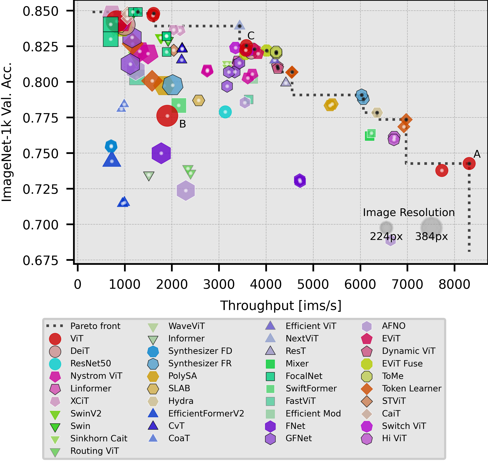

# Which Transformer to Favor: <br>A Comparative Analysis of Efficiency in Vision Transformers


This is the code for the paper [Which Transformer to Favor: A Comparative Analysis of Efficiency in Vision Transformers](https://arxiv.org/abs/2308.09372), a benchmark of over 45+ different efficient vision trainsformers.
We train models from scratch and track multiple efficiency metrics.

### Abstract
Self-attention in Transformers comes with a high computational cost because of their quadratic computational complexity, but their effectiveness in addressing problems in language and vision has sparked extensive research aimed at enhancing their efficiency.
However, diverse experimental conditions, spanning multiple input domains, prevent a fair comparison based solely on reported results, posing challenges for model selection.
To address this gap in comparability, we perform a large-scale benchmark of more than 45 models for image classification, evaluating key efficiency aspects, including accuracy, speed, and memory usage.
Our benchmark provides a standardized baseline for efficiency-oriented transformers.
We analyze the results based on the Pareto front -- the boundary of optimal models.
Surprisingly, despite claims of other models being more efficient, ViT remains Pareto optimal across multiple metrics.
We observe that hybrid attention-CNN models exhibit remarkable inference memory- and parameter-efficiency.
Moreover, our benchmark shows that using a larger model in general is more efficient than using higher resolution images. 
Thanks to our holistic evaluation, we provide a centralized resource for practitioners and researchers, facilitating informed decisions when selecting or developing efficient transformers.

## Updates
- [10.09.2024] We are happy to announce that the benchmark has been accepted for publication at WACV 2025 :tada:
- [22.07.2024] We have released a [new version of the paper on ArXiv](https://arxiv.org/pdf/2308.09372v3) featuring 12 new models and more analysis into the scaling behaviors :newspaper_roll:
- [19.07.2024] We have added [AFNO](architectures/afno.py), [EfficientMod](architectures/efficient_mod.py), [EfficientViT](architectures/efficient_vit.py), [FastViT](architectures/fastvit.py), [HiViT](architectures/hivit.py), [Hydra Attention](architectures/hydra_attention.py), [Informer](architectures/informer.py), [Next-ViT](architectures/next_vit.py), [Reformer](architectures/reformer.py), [ResT](architectures/rest.py), [SLAB](architectures/slab.py), and [SwiftFormer](architectures/swiftformer.py) to the benchmark :gear:
- [19.07.2024] We have uniformly reformatted most files :black_flag:


## Requirements
This project heavily builds on [timm](https://github.com/huggingface/pytorch-image-models) and open source implementations of the models that are tested.
All requirements are listed in [requirements.txt](./requirements.txt).
To install those, run
```commandline
pip install -r requirements.txt
```

## Usage
After **cloning this repository**, you can train and test a lot of different models.
By default, a `srun` command is executed to run the code on a slurm cluster. 
To run on the local machine, append the `-local` flag to the command.

### Dataset Preparation
Supported datasets are CIFAR10, ImageNet-21k, and ImageNet-1k.

The CIFAR10 dataset has to be located in a subfolder of the dataset root directory called `CIFAR`.
This is the normal `CIFAR10` from `torchvision.datasets`.

To speed up the data loading, the ImageNet datasets are read using [`datadings`](https://datadings.readthedocs.io/en/stable/). 
The `.msgpack` files for **ImageNet-1k** should be located in `<dataset_root_folder>/imagenet/msgpack`, 
while the ones for **ImageNet-21k** should be in `<dataset_root_folder>/imagenet-21k`.
See the [datadings documentation](https://datadings.readthedocs.io/en/stable/) for information on how to create those files.

### Training
#### Pretraining
To pretrain a model on a given dataset, run
```commandline
./main.py -model <model_name> -epochs <epochs> -dataset_root <dataset_root_folder>/ -results_folder <folder_for_results>/ -logging_folder <logging_folder> -run_name <name_or_description_of_the_run> (-local)
```
This will save a checkpoint (`.tar` file) every `<save_epochs>` epochs (the default is 10), which contains all the model weights, along with the optimizer and scheduler state, and the current training stats.
The default pretraining dataset is ImageNet-21k.

#### Finetuning
A model (checkpoint) can be finetuned on another dataset using the following command:
```commandline
./main.py -task fine-tune -model <model_checkpoint_file.tar> -epochs <epochs> -lr <lr> -dataset_root <dataset_root_folder>/ -results_folder <folder_for_results>/ -logging_folder <logging_folder> -run_name <name_or_description_of_the_run> (-local)
```
This will also save new checkpoints during training.
The default finetuning dataset is ImageNet-1k.

### Evaluation
It is also possible to evaluate the models.
To evaluate the model's accuracy and the efficiency metrics, run
```commandline
./main.py -task eval -model <model_checkpoint_file.tar> -dataset_root <dataset_root_folder>/ -results_folder <folder_for_results>/ -logging_folder <logging_folder> -run_name <name_or_description_of_the_run> (-local)
```
The default evaluation dataset is ImageNet-1k.

To only evaluate the efficiency metrics, run
```commandline
./main.py -task eval-metrics -model <model_checkpoint_file.tar> -dataset_root <dataset_root_folder>/ -results_folder <folder_for_results>/ -logging_folder <logging_folder> -run_name <name_or_description_of_the_run> (-local)
```
This utilizes the CIFAR10 dataset by default.

### Further Arguments
There can be multiple further arguments and flags given to the scripts.
The most important ones are

| Arg                                | Description                                            |
|:-----------------------------------|:-------------------------------------------------------|
| `-model <model>`                   | Model name or checkpoint.                              |
| `-run_name <name for the run>`     | Name or description of this training run.              |
| `-dataset <dataset>`               | Specifies a dataset to use.                            |
| `-task <task>`                     | Specifies a task. The default is `pre-train`.          |
| `-local`                           | Run on the local machine, not on a slurm cluster.      |
| `-dataset_root <dataset root>`     | Root folder of the datasets.                           |
| `-results_folder <results folder>` | Folder to save results into.                           |
| `-logging_folder <logging folder>` | Folder for saving logfiles.                            |
| `-epochs <epochs>`                 | Epochs to train.                                       |
| `-lr <lr>`                         | Learning rate. Default is 3e-3.                        |
| `-batch_size <bs>`                 | Batch size. Default is 2048.                           |
| `-weight_decay <wd>`               | Weight decay. Default is 0.02.                         |
| `-imsize <image resolution>`       | Resulution of the image to train with. Default is 224. |

For a list of all arguments, run
```commandline
./main.py --help
```

## Supported Models
These are the models we support. Links are to original code sources. If no link is provided, we implemented the architecture from scratch, following the specific paper.

| Architecture                                                                                                                                        | Versions                                                                                                                                                                                                                                                                                                                                                                                                                                                                                       |
|:----------------------------------------------------------------------------------------------------------------------------------------------------|:-----------------------------------------------------------------------------------------------------------------------------------------------------------------------------------------------------------------------------------------------------------------------------------------------------------------------------------------------------------------------------------------------------------------------------------------------------------------------------------------------|
| [AViT](https://github.com/NVlabs/A-ViT/blob/master/timm/models/act_vision_transformer.py)                                                           | `avit_tiny_patch16`, `avit_small_patch16`, `avit_base_patch16`, `avit_large_patch16`                                                                                                                                                                                                                                                                                                                                                                                                           |
| [AFNO](https://github.com/NVlabs/AFNO-transformer/blob/master/classification/afnonet.py)   | `afno_ti_p16`, `afno_s_p16`, `afno_b_p16`, `afno_l_p16` |
| [CaiT](https://github.com/huggingface/pytorch-image-models/blob/main/timm/models/cait.py)                                                           | `cait_xxs24`, `cait_xxs36`, `cait_xs24`, `cait_s24`, `cait_s36`, `cait_m36`, `cait_m48`                                                                                                                                                                                                                                                                                                                                                                                                        |
| [CoaT](https://github.com/huggingface/pytorch-image-models/blob/main/timm/models/coat.py)                                                           | `coat_tiny`, `coat_mini`, `coat_small`, `coat_lite_tiny`, `coat_lite_mini`, `coat_lite_small`, `coat_lite_medium`                                                                                                                                                                                                                                                                                                                                                                              |
| [CvT](https://github.com/microsoft/CvT/blob/main/lib/models/cls_cvt.py)                                                                             | `cvt_13`, `cvt_21`, `cvt_w24`                                                                                                                                                                                                                                                                                                                                                                                                                                                                  |
| [DeiT](https://github.com/facebookresearch/deit)                                                                                                    | `deit_tiny_patch16_LS`, `deit_small_patch16_LS`, `deit_medium_patch16_LS`, `deit_base_patch16_LS`, `deit_large_patch16_LS`, `deit_huge_patch14_LS`, `deit_huge_patch14_52_LS`, `deit_huge_patch14_26x2_LS`, `deit_Giant_48_patch14_LS`, `deit_giant_40_patch14_LS`, `deit_small_patch16_36_LS`, `deit_small_patch16_36`, `deit_small_patch16_18x2_LS`, `deit_small_patch16_18x2`, `deit_base_patch16_18x2_LS`, `deit_base_patch16_18x2`, `deit_base_patch16_36x1_LS`, `deit_base_patch16_36x1` |
| [DynamicViT](https://github.com/raoyongming/DynamicViT/blob/master/models/dyvit.py)                                                                 | `dynamic_vit_tiny_patch16`, `dynamic_vit_90_tiny_patch16`, `dynamic_vit_70_tiny_patch16`, `dynamic_vit_small_patch16`, `dynamic_vit_90_small_patch16`, `dynamic_vit_70_small_patch16`, `dynamic_vit_base_patch16`, `dynamic_vit_70_base_patch16`, `dynamic_vit_90_base_patch16`, `dynamic_vit_large_patch16`, `dynamic_vit_90_large_patch16`, `dynamic_vit_70_large_patch16`                                                                                                                   |
| [EfficientFormerV2](https://github.com/snap-research/EfficientFormer/blob/main/models/efficientformer_v2.py)                                        | `efficientformerv2_s0`, `efficientformerv2_s1`, `efficientformerv2_s2`, `efficientformerv2_l`  |
| [EfficientMod](https://github.com/ma-xu/EfficientMod/blob/main/models/EfficientMod.py) | `efficient_mod_xxs`, `efficient_mod_xs`, `efficient_mod_s` |
| [EfficientViT](https://github.com/CVHub520/efficientvit/blob/main/efficientvit/models/efficientvit/backbone.py) | `efficient_vit_b0`, `efficient_vit_b1`, `efficient_vit_b2`, `efficient_vit_b3`, `efficient_vit_l1`, `efficient_vit_l2` |
| [EViT](https://github.com/youweiliang/evit)               | `evit_tiny_patch16`, `evit_tiny_patch16_fuse`, `evit_small_patch16`, `evit_small_patch16_fuse`, `evit_base_patch16`, `evit_base_patch16_fuse`  |
| [Fast-ViT](https://github.com/apple/ml-fastvit/blob/main/models/fastvit.py) | `fastvit_t8`, `fastvit_t12`, `fastvit_s12`, `fastvit_sa12`, `fastvit_sa24`, `fastvit_sa36`, `fastvit_m36` |
| FNet                  | `fnet_vit_tiny_patch16`, `fnet_vit_small_patch16`, `fnet_vit_base_patch16`, `fnet_vit_large_patch16`, `fnet_vit_tiny_patch4`, `fnet_vit_small_patch4`, `fnet_vit_base_patch4`, `fnet_vit_large_patch4`          |
| [FocalNet](https://github.com/microsoft/FocalNet/blob/main/classification/focalnet.py)                                                              | `focalnet_tiny_srf`, `focalnet_small_srf`, `focalnet_base_srf`, `focalnet_tiny_lrf`, `focalnet_small_lrf`, `focalnet_base_lrf`, `focalnet_tiny_iso`, `focalnet_small_iso`, `focalnet_base_iso`, `focalnet_large_fl3`, `focalnet_large_fl4`, `focalnet_xlarge_fl3`, `focalnet_xlarge_fl4`, `focalnet_huge_fl3`, `focalnet_huge_fl4` |
| [GFNet](https://github.com/raoyongming/GFNet)   | `gfnet_tiny_patch4`, `gfnet_extra_small_patch4`, `gfnet_small_patch4`, `gfnet_base_patch4`, `gfnet_tiny_patch16`, `gfnet_extra_small_patch16`, `gfnet_small_patch16`, `gfnet_base_patch16`  |
| [HaloNet](https://github.com/lucidrains/halonet-pytorch) | `halonet_h0`, `halonet_h1`, `halonet_h2` |
| [HiViT](https://github.com/yuhongtian17/Spatial-Transform-Decoupling/blob/main/mmrotate-main/models/models_hivit.py) | `hi_vit_tiny_patch16`, `hi_vit_small_patch16`, `hi_vit_base_patch16`, `hi_vit_large_patch16` |
| [Hydra Attention](https://github.com/robflynnyh/hydra-linear-attention/blob/main/hydra.py) | `hydra_vit_tiny_patch16`, `hydra_vit_small_patch16`, `hydra_vit_base_patch16`, `hydra_vit_large_patch16` |
| [Informer](https://github.com/zhouhaoyi/Informer2020/blob/main/models/attn.py) |  `informer_vit_tiny_patch16`, `informer_vit_small_patch16`, `informer_vit_base_patch16`, `informer_vit_large_patch16` |
| Linear Transformer | `linear_vit_tiny_patch16`, `linear_vit_small_patch16`, `linear_vit_base_patch16`, `linear_vit_large_patch16` |
| [Linformer](https://github.com/lucidrains/linformer) | `linformer_vit_tiny_patch16`, `linformer_vit_small_patch16`, `linformer_vit_base_patch16`, `linformer_vit_large_patch16`|
| [MLP-Mixer](https://github.com/huggingface/pytorch-image-models/blob/main/timm/models/mlp_mixer.py) | `mixer_s32`, `mixer_s16`, `mixer_b32`, `mixer_b16`, `mixer_l32`, `mixer_l16` |
| [Next-ViT](https://github.com/bytedance/Next-ViT/blob/main/classification/nextvit.py) | `nextvit_small`, `nextvit_base`, `nextvit_large` |
| [NyströmFormer](https://github.com/mlpen/Nystromformer/blob/main/ImageNet/T2T-ViT/models/token_nystromformer.py) | `nystrom64_vit_tiny_patch16`, `nystrom32_vit_tiny_patch16`, `nystrom64_vit_small_patch16`, `nystrom32_vit_small_patch16`, `nystrom64_vit_base_patch16`, `nystrom32_vit_base_patch16`, `nystrom64_vit_large_patch16`, `nystrom32_vit_large_patch16` |
| [Permormer](https://github.com/lucidrains/performer-pytorch) | `performer_vit_tiny_patch16`, `performer_vit_small_patch16`, `performer_vit_base_patch16`, `performer_vit_large_patch16` |
| PolySA | `polysa_vit_tiny_patch16`, `polysa_vit_small_patch16`, `polysa_vit_base_patch16`, `polysa_vit_large_patch16` |
| [Reformer](https://github.com/lucidrains/reformer-pytorch) | `reformer_vit_tiny_patch16`, `reformer_vit_small_patch16`, `reformer_vit_base_patch16`, `reformer_vit_large_patch16` |
| [ResNet](https://github.com/huggingface/pytorch-image-models/blob/main/timm/models/resnet.py) | `resnet18`, `resnet34`, `resnet26`, `resnet50`, `resnet101`, `wide_resnet50_2` |
| [ResT](https://github.com/wofmanaf/ResT/blob/main/models/rest.py) | `rest_lite`, `rest_small`, `rest_base`, `rest_large` |
| [Routing Transformer](https://github.com/lucidrains/routing-transformer) | `routing_vit_tiny_patch16`, `routing_vit_small_patch16`, `routing_vit_base_patch16`, `routing_vit_large_patch16` |
| [Sinkhorn Transformer](https://github.com/lucidrains/sinkhorn-transformer) | `sinkhorn_cait_tiny_bmax32_patch16`, `sinkhorn_cait_tiny_bmax64_patch16`, `sinkhorn_cait_small_bmax32_patch16`, `sinkhorn_cait_small_bmax64_patch16`, `sinkhorn_cait_base_bmax32_patch16`, `sinkhorn_cait_base_bmax64_patch16`, `sinkhorn_cait_large_bmax32_patch16`, `sinkhorn_cait_large_bmax64_patch16` |
| [SLAB](https://github.com/xinghaochen/SLAB/blob/main/classification/models/slab_deit.py) | `slab_tiny_patch16`, `slab_small_patch16` |
| [STViT](https://github.com/changsn/STViT-R/blob/main/models/swin_transformer.py)  | `stvit_swin_tiny_p4_w7`, `stvit_swin_base_p4_w7` |
| [SwiftFormer](https://github.com/Amshaker/SwiftFormer/blob/main/models/swiftformer.py) | `swiftformer_xs`, `swiftformer_s`, `swiftformer_l1`, `swiftformer_l3` |
| [Swin](https://github.com/microsoft/Swin-Transformer)| `swin_tiny_patch4_window7`, `swin_small_patch4_window7`, `swin_base_patch4_window7`, `swin_large_patch4_window7` |
| [SwinV2](https://github.com/microsoft/Swin-Transformer/blob/main/models/swin_transformer_v2.py) | `swinv2_tiny_patch4_window7`, `swinv2_small_patch4_window7`, `swinv2_base_patch4_window7`, `swinv2_large_patch4_window7` |
| [Switch Transformer](https://github.com/labmlai/annotated_deep_learning_paper_implementations/blob/master/labml_nn/transformers/switch/__init__.py) | `switch_8_vit_tiny_patch16`, `switch_8_vit_small_patch16`, `switch_8_vit_base_patch16`, `switch_8_vit_large_patch16`|
| [Synthesizer](https://github.com/10-zin/Synthesizer/blob/master/synth/synthesizer/modules.py) | `synthesizer_fd_vit_tiny_patch16`, `synthesizer_fr_vit_tiny_patch16`, `synthesizer_fd_vit_small_patch16`, `synthesizer_fr_vit_small_patch16`, `synthesizer_fd_vit_base_patch16`, `synthesizer_fr_vit_base_patch16`, `synthesizer_fd_vit_large_patch16`, `synthesizer_fr_vit_large_patch16` |
| [TokenLearner](https://github.com/google-research/scenic/blob/main/scenic/projects/token_learner/model.py) | `token_learner_vit_8_50_tiny_patch16`, `token_learner_vit_8_75_tiny_patch16`, `token_learner_vit_8_50_small_patch16`, `token_learner_vit_8_75_small_patch16`, `token_learner_vit_8_50_base_patch16`, `token_learner_vit_8_75_base_patch16`, `token_learner_vit_8_50_large_patch16`, `token_learner_vit_8_75_large_patch16` |
| [ToMe](https://github.com/facebookresearch/ToMe/blob/main/tome/patch/timm.py) | `tome_vit_tiny_r8_patch16`, `tome_vit_tiny_r13_patch16`, `tome_vit_small_r8_patch16`, `tome_vit_small_r13_patch16`, `tome_vit_base_r8_patch16`, `tome_vit_base_r13_patch16`, `tome_vit_large_r8_patch16`, `tome_vit_large_r13_patch16`|
| [ViT](https://github.com/huggingface/pytorch-image-models/blob/main/timm/models/vision_transformer.py) | `ViT-{Ti,S,B,L}/<patch_size>`  |
| [Wave ViT](https://github.com/YehLi/ImageNetModel/blob/main/classification/wavevit.py)  | `wavevit_s`, `wavevit_b`, `wavevit_l` |
| [XCiT](https://github.com/facebookresearch/xcit) | `xcit_nano_12_p16`, `xcit_tiny_12_p16`, `xcit_small_12_p16`, `xcit_tiny_24_p16`, `xcit_small_24_p16`, `xcit_medium_24_p16`, `xcit_large_24_p16`, `xcit_nano_12_p8`, `xcit_tiny_12_p8`, `xcit_small_12_p8`, `xcit_tiny_24_p8`, `xcit_small_24_p8`, `xcit_medium_24_p8`, `xcit_large_24_p8` |


## License
We release this code under the [MIT license](./LICENSE).

## Citation
If you use this codebase in your project, please cite:
```BibTex
@misc{Nauen2023WTFBenchmark,
      title={Which Transformer to Favor: A Comparative Analysis of Efficiency in Vision Transformers}, 
      author={Tobias Christian Nauen and Sebastian Palacio and Andreas Dengel},
      year={2023},
      eprint={2308.09372},
      archivePrefix={arXiv},
      primaryClass={cs.CV},
      note={Accepted at WACV 2025}
}
```
